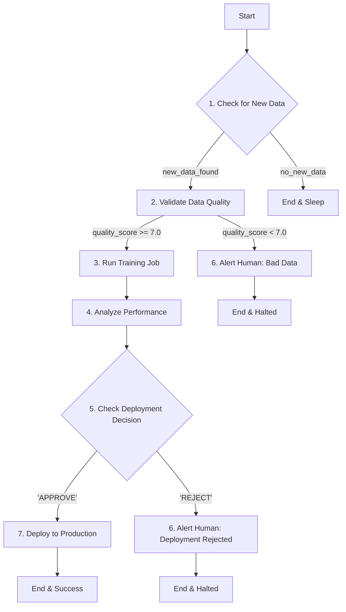

# MLOps Orchestrator for Mango Ripeness Detection using LangGraph

## 1. Overview

This project implements an advanced MLOps pipeline to manage the lifecycle of a Deep Learning (DL) model for mango ripeness detection. The core challenge in production-level DL is not just model training, but the continuous orchestration, validation, and failure analysis required to maintain performance.

To address this, we use **LangGraph** not to train the model itself, but to build an **intelligent, cyclical, and reactive Orchestrator Agent**. This agent acts as a "smart manager" for our DL model (the "brute-force worker," e.g., a MobileNetV2), deciding when it should train, evaluating its performance, and managing its deployment.

The final system is designed for cloud deployment, potentially on a PaaS like OCI, where it will manage the re-training and deployment of a `.tflite` model used in a mobile application.

## 2. Core Architecture

The system is composed of two main parts:

- **The DL Worker**: A standard computer vision model (e.g., MobileNetV2) trained to classify the ripeness of mangoes from images. Its only job is to train on new data and produce a model artifact.
- **The LangGraph Orchestrator**: An intelligent agent that manages the entire MLOps workflow, from data ingestion to deployment. It operates based on a state machine defined in a graph structure.

### 2.1. The Graph State

The entire orchestration process is driven by a shared state object that is passed between nodes in the graph.

```python
from typing import TypedDict

class MLOpsState(TypedDict):
    new_data_path: str                 # Location of new mango images
    model_version: int                 # Current version (e.g., 2)
    candidate_model_path: str          # Path to the newly trained model
    candidate_metrics: dict            # Metrics of the new model (e.g., {'accuracy': 0.92})
    production_metrics: dict           # Metrics of the model in production
    deployment_decision: str           # "APPROVE", "REJECT", "HUMAN_REVIEW"
    failure_analysis_report: str       # Report explaining why a process failed
```

## 3. The Orchestration Flow

The agent operates as a cyclical graph, capable of handling complex logic, retries, and human-in-the-loop interventions.



### 3.1. Node Descriptions

**Node 1: `check_for_new_data` (Data Ingest)**

- **Action**: A script monitors a cloud storage bucket (e.g., OCI/S3) for new data uploads.
- **Edge Logic**:
  - If new data is found, it updates `new_data_path` in the state and transitions to `validate_data`.
  - If not, the graph run ends and waits for the next scheduled trigger.

**Node 2: `validate_data` (A2A with a VLM)**

- **Action**: An Agent-to-Agent (A2A) call is made to a Vision Language Model (VLM) like Gemini 1.5 Pro.
- **Prompt to VLM**: *"Analyze a sample of images from `new_data_path`. Are they clear photos of mangoes? Are they blurry, poorly lit, or corrupt? Return a JSON with a `quality_score` out of 10."*
- **Edge Logic**:
  - If `quality_score` is high (e.g., >= 7.0), the data is good for training. Transition to `run_training_job`.
  - If `quality_score` is low, training is aborted. Transition to `alert_human`.

**Node 3: `run_training_job` (The DL Worker Tool)**

- **Action**: This node executes the `train_model.py` script. This is a long-running, non-LLM tool that trains the DL model on the validated new data.
- **Output**: It saves the new model artifact (e.g., `mango_model_v3.tflite`) and its performance metrics (`metrics_v3.json`).
- **Transition**: Proceeds to `analyze_performance`.

**Node 4: `analyze_performance` (The LLM Analyst)**

- **Action**: This is the core "intelligent" node. An LLM receives the metrics for the new candidate model and the current production model.
- **Prompt to LLM**: *"The production model v2 has `{'accuracy': 0.91, 'f1_class_maduro': 0.88}`. The candidate v3 has `{'accuracy': 0.90, 'f1_class_maduro': 0.95}`. Is v3 a better model for our business goal of identifying ripe mangoes? The overall accuracy dropped, but the F1 score for the key 'maduro' class increased significantly. Generate a JSON with a `decision` ('APPROVE' or 'REJECT') and a `reason`."*
- **Output**: The LLM provides a nuanced decision, e.g., `{'decision': 'APPROVE', 'reason': 'Although overall accuracy dropped 1%, the F1 score for the critical "maduro" class improved by 7%, which is a worthwhile trade-off for the business.'}`.
- **Transition**: Proceeds to `check_deployment_decision`.

**Node 5: `check_deployment_decision`**

- **Action**: A simple conditional node that reads the `deployment_decision` from the state.
- **Edge Logic**:
  - If `APPROVE`, transition to `deploy_to_production`.
  - If `REJECT`, transition to `alert_human` to report the rejection.

**Node 6: `alert_human` (Failure/Rejection Reporting)**

- **Action**: This node is triggered by data validation failure or deployment rejection. It uses the `failure_analysis_report` or the rejection `reason` from the state to send a detailed, actionable notification to a human operator via Slack, Teams, or email.
- **Example Alert**: *"🛑 Deployment of mango model REJECTED. Reason: The new model v3 confused 'green mango' with 'leaf' 15% more often than v2."*
- **Transition**: The graph run ends, awaiting human intervention or the next cycle.

**Node 7: `deploy_to_production`**

- `.env`: Stores environment variables like API keys and bucket names.
- `requirements.txt`: Lists all Python dependencies for the project.
- `src/`: Contains the main source code for the orchestrator agent and related tools.
- `notebooks/`: Jupyter notebooks for prototyping, testing, and visualization.
- `tests/`: Unit and integration tests for the MLOps pipeline.

## 4. Project Structure

- `.env`: Stores environment variables like API keys and bucket names.

1. **Create a virtual environment:**

   ```bash
   python -m venv myLinuxVenv
   source myLinuxVenv/bin/activate
   ```

2. **Install dependencies:**

   ```bash
   pip install -r requirements.txt
   ```

3. **Configure environment:**

   - Copy `.env.example` to `.env` and fill in your API keys and other configuration details.

4. **Run the orchestrator:**

   ```bash
   python src/main.py
   ```
