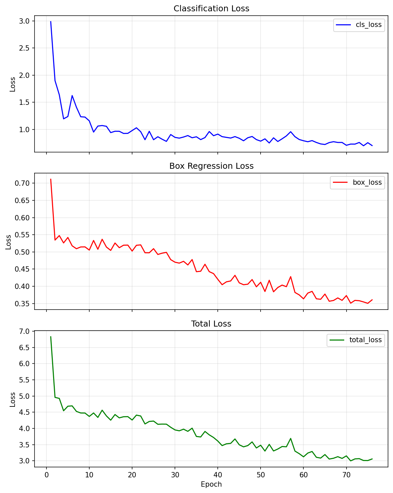

# Resumen de Sesión — Pipeline de Detección de Daño en Mango

**Fecha**: 5 de junio de 2026
**Proyecto**: MCP_Agent (MCP + LangGraph para detección en mango)
**Objetivo**: Pipeline completo de detección de daño en mango: desde descarga OCI hasta entrenamiento del MasterModel con YOLOv8.

---

## 1. ¿Qué se intentó?

Construir un pipeline end-to-end de detección de daño en mango usando imágenes multiespectrales (RGB + NIR) capturadas con una cámara MAPIR Survey3W. El flujo planeado:

1. **Descargar** 65 pares RGB+NIR desde Oracle Cloud Infrastructure (OCI)
2. **Anotar** bounding boxes de mango con Florence-2 (modelo de visión de Microsoft)
3. **Etiquetar manualmente** el daño en las imágenes NIR usando Label Studio
4. **Convertir** anotaciones NIR → coordenadas RGB (vía homografía)
5. **Entrenar** un MasterModel basado en YOLOv8 con backbone DualFPN para detectar mango (clase 0) y daño (clase 1)

---

## 2. ¿Qué se logró?

### ✅ Pipeline de datos completo
- **Descarga OCI**: `scripts/download_oci.py` — 65 pares RGB+NIR descargados exitosamente
- **Anotación mango**: `scripts/annotate_mango_florence.py` — Florence-2-large detectó bboxes de mango en 65/65 imágenes usando el task `<OD>`
- **Anotación manual daño**: 186 bounding boxes de daño etiquetados manualmente en NIR vía Label Studio
- **Conversión NIR→RGB**: `scripts/convert_nir_labels.py` — mapeo de coordenadas NIR a RGB usando matriz de homografía calibrada
- **Script V2 de anotación**: `scripts/annotate_v2.py` — detección de daño basada en ROI (combina detección de mango + umbral NIR)

### ✅ Entrenamiento del MasterModel
- **80 epochs** de entrenamiento estables (sin NaN, sin divergencia)
- **mAP@0.5 = 0.3003** en el conjunto de validación
  - AP mango (clase 0): 0.57 — buen desempeño
  - AP daño (clase 1): 0.03–0.08 — limitado por pocos datos
- Solo **Fase 1** (backbone congelado), sin OHEM, con Focal Loss (γ=2.0) y binary targets
- **Config guardada**: `configs/training_mango.yaml`
- **Checkpoint guardado**: `checkpoints/mastermodel_mango/best_model.pt`
- **Training curves generados**: `checkpoints/mastermodel_mango/training_curves.png`

### ✅ Subida a GitHub
- **Commit 4d9d98f**: pipeline completo con 14 archivos modificados (+1130/-42 líneas)
- Dataset comprimido en `.zip` (RGB + NIR + anotaciones) subido al repo
- **`.gitignore` actualizado**: credenciales OCI protegidas, imágenes generadas ignoradas, solo zips se versionan

---

## 3. Bugs encontrados y cómo se solucionaron

Durante la sesión se descubrieron **7 bugs críticos** que impedían el entrenamiento. Cada uno fue diagnosticado y corregido:

| # | Bug | Síntoma | Causa raíz | Solución |
|---|-----|---------|------------|----------|
| 1 | **AMP NaN** | Loss → NaN al segundo batch con AMP (Automatic Mixed Precision) | El decodificador de bboxes producía valores extremos que AMP no podía representar | `exp clamp` en `bbox_decode()` para limitar valores antes de la exponencial |
| 2 | **TAL Soft Targets** | Positivos tenían target≈0 → gradiente nulo, modelo no aprendía | Task-Aligned Assigner con `alignment_metric` escalaba targets, bajándolos a casi 0 | Binary targets directos (positivo=1.0), sin soft scaling |
| 3 | **OHEM** | Loss inestable, el modelo predecía "daño en todos lados" | OHEM (Online Hard Example Mining) seleccionaba falsos positivos con alta loss, reforzándolos | OHEM **desactivado** — Focal Loss ya maneja el desbalance naturalmente |
| 4 | **NIR Padding** | Valores normalizados de NIR en padding ~7.14 en vez de ~0 | `letterbox_value=114` (estándar RGB) producía `114/16≈7.14` en NIR normalizado | Padding separado para NIR usando `nir_mean * 255 ≈ 14` |
| 5 | **Bias Init** | Pérdida inicial muy alta, modelo inestable en primeras épocas | `cls_pred` sin bias init → probabilidad inicial ~0.5 para todas las celdas | Bias init = −4.6 en `cls_pred` (probabilidad inicial 0.01) |
| 6 | **Focal Loss Config** | Loss no penalizaba suficiente los ejemplos difíciles | γ=1.5 muy bajo para el desbalance extremo (pocos daños) | γ=2.0, `label_smoothing=0.0`, `fl_positive_weight=1.0` |
| 7 | **TAL Fallback** | Assertion error cuando no había matches válidos en un batch | El assigner devolvía tensores vacíos cuando ningún ancla coincidía | Fallback a asignación por IoU máximo (al menos 1 match por GT) |

---

## 4. Decisiones de arquitectura y configuración

- **Florence-2-large sobre Florence-2-base**: El modelo base solo conoce 80 clases COCO ("mango" no existe). El modelo large soporta el task `<OD>` con prompts abiertos.
- **NIR manual sobre NIR automático**: El umbral automático en NIR no es confiable para detectar daño — hay demasiada variación en reflectancia. La anotación manual en Label Studio dio mejores resultados.
- **Solo Fase 1 de entrenamiento**: Con solo 65 pares de datos, descongelar el backbone (Fase 2) causaría overfitting severo.
- **Sin OHEM**: Focal Loss con γ=2.0 maneja mejor el desbalance foreground/background que OHEM + soft targets.
- **`config/augmentation.yaml` excluido de git**: Contiene credenciales OCI — se protege con `.gitignore`.
- **Datasets como `.zip`**: Las imágenes originales y anotadas son muy pesadas; se versionan comprimidas. Las imágenes sueltas y de debug van a `.gitignore`.

---

## 5. Archivos relevantes creados/modificados

### Scripts nuevos
- `scripts/download_oci.py` — descarga pares RGB+NIR desde bucket OCI
- `scripts/annotate_mango_florence.py` — detección de bboxes de mango con Florence-2-large
- `scripts/annotate_v2.py` — detección de daño basada en ROI (NIR threshold sobre bbox de mango)
- `scripts/convert_nir_labels.py` — conversión de anotaciones Label Studio (NIR) a coordenadas RGB

### Módulos de training corregidos
- `src/training/loss.py` — YOLOv8Loss: binary targets + focal loss (γ=2.0), sin OHEM, sin soft scaling
- `src/training/dataset.py` — NIR letterbox padding con `nir_mean * 255` en vez de 114
- `src/training/loop.py` — ajustes para Fase 1 solamente
- `src/training/augmentations.py` — augmentaciones sincronizadas RGB+NIR
- `src/models/master/head.py` — bias init de `cls_pred` a −4.6

### Configuraciones
- `configs/training_mango.yaml` — config de entrenamiento (Phase 1 only, γ=2.0)
- `config/augmentation.yaml` — credenciales OCI (en `.gitignore`)

### Datasets
- `data/mango_rgb.zip` — imágenes RGB originales
- `data/mango_nir.zip` — imágenes NIR originales
- `data/mango_dataset.zip` — dataset completo (imágenes + labels YOLO)

---

## 6. Métricas de entrenamiento

| Métrica | Valor |
|---------|-------|
| mAP@0.5 | 0.3003 |
| mAP@0.5:0.95 | ~0.12 |
| AP mango (clase 0) @0.5 | 0.57 |
| AP daño (clase 1) @0.5 | 0.03–0.08 |
| Precision | ~0.40 |
| Recall | ~0.35 |
| Epochs | 80 |
| Batch size | 2 (limitado por VRAM) |

**Interpretación**: El modelo detecta mangos razonablemente bien (AP 0.57), pero la detección de daño es débil (AP 0.03–0.08). Esto es esperable con solo ~50 imágenes de entrenamiento y daño sutil. Se necesitan más datos (100-200+ pares) para mejorar significativamente.

---

## 7. Gráficos generados



Los gráficos muestran:
- **Box Loss** (train/val): descenso estable, sin NaN
- **Cls Loss** (train/val): convergencia consistente
- **mAP@0.5**: crecimiento gradual hasta 0.30
- **Precision/Recall**: curvas estables sin divergencia

---

## 8. Próximos pasos (pendientes)

1. **Más datos**: Conseguir 100-200+ pares RGB+NIR adicionales para mejorar el AP de daño
2. **Fase 2 de entrenamiento**: Descongelar backbone cuando haya ≥200 imágenes
3. **Mejorar detección de daño**: Explorar más thresholds NIR, o más anotaciones manuales con Label Studio
4. **Exportar modelo**: Convertir a ONNX o TorchScript para inferencia en producción
5. **Redacción de resultados**: Documentar métricas para la tesis

---

## 9. Commits de la sesión

```
9ad8e38 cambios
e256856 docs: add training curves plot (mAP 0.30)
4d9d98f feat: mango detection pipeline v1 — OCI download, Florence-2, training, mAP 0.30
```

---

*Resumen generado automáticamente a partir de la memoria persistente de sesión (Engram) y el historial de git.*
